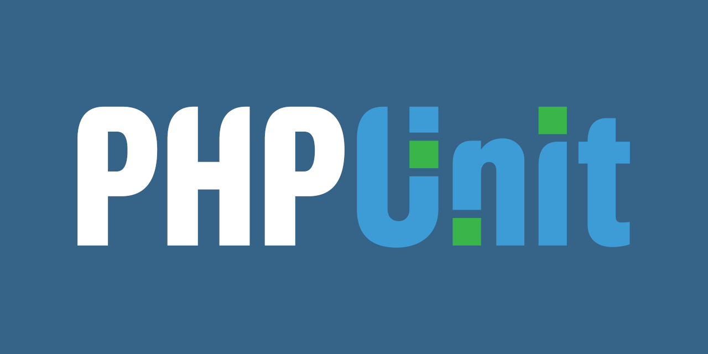

<div align='center'>

</div>
<br />

<h3 align='center'>GESUAS</h3>
<div align='center'>
    Projeto API - NIS
    <br />
</div>
<div align='center'>
<h3>Build With</h3>




</div>
<br />
<br />


# Sistema de Gerenciamento de Cidadãos - NIS

O Sistema de Gerenciamento de Cidadãos NIS é uma aplicação PHP que gerencia as informações do NIS dos cidadãos. Ele utiliza SQLite3 como banco de dados, FastRoute para roteamento e Guzzle para implementação de mensagens PSR-7. A aplicação é containerizada usando Docker.

NIS é o Número de Identificação Social, um número de cadastro único para cada cidadão brasileiro. O NIS é usado para identificar os cidadãos que recebem benefícios sociais do governo, como o Bolsa Família.
Ele é composto por 11 dígitos, sendo 10 dígitos numéricos e 1 dígito verificador. No seguinte formato e padrão: `000.00000.00-X`. O dígito verificador (X) é calculado usando o algoritmo de Luhn.

## Começando

Estas instruções permitirão que você obtenha uma cópia do projeto em funcionamento na sua máquina local para fins de desenvolvimento e teste.

### Pré-requisitos

Você não é obrigado a executar com o Docker, mas isso implica em pré-requisitos diferentes. Se você não quiser usar o Docker, pule para a seção [Instalação sem Docker](#instalação-sem-docker).
Você precisa ter o Docker e Docker Compose instalados na sua máquina. Você também precisa do Composer para gerenciar as dependências do PHP.

### Instalação

1. Clone o repositório:

```bash
git clone git@github.com:pipas2309/gesuas.git
```

2. Navegue até o diretório do projeto:

```bash
cd gesuas
```

3. Instale as dependências do PHP:

```bash
composer install
```

4. Construa e inicie o contêiner Docker:

```bash
docker-compose up --build
```

Agora a aplicação deve estar acessível em `http://localhost:8000`.

#

### Instalação sem Docker

### Pré-requisitos

Você vai precisar do PHP 7.4 ou superior e do Composer instalados na sua máquina. Também pode ser necessário, dependendo da sua configuração, instalar o SQLite3 e PHP Unit.

### Instalação

1. Clone o repositório:

```bash
git clone git@github.com:pipas2309/gesuas.git
```

2. Navegue até o diretório do projeto:

```bash 
cd gesuas
```

3. Instale as dependências do PHP:

```bash
composer install
```

4. Inicie o servidor PHP:

```bash
php -S localhost:8000
```

<br />

## Estrutura do Projeto

O projeto é organizado em vários diretórios:

- `src`: Contém o código-fonte da aplicação.
    - `Controller`: Contém as classes do controlador.
    - `Model`: Contém as classes de modelo.
    - `Repository`: Contém as classes de repositório para interação com o banco de dados.
    - `Util`: Contém classes utilitárias.
    - `View`: Contém classes de visualização para formatar mensagens de resposta.
    - `config`: Contém arquivos de configuração.
- `tests`: Contém os testes unitários.
- `assets`: Contém arquivos de imagem.

## Uso

A aplicação fornece os seguintes endpoints:

- `POST /citizen`: Cadastra um novo cidadão. O corpo da requisição deve conter um campo `name`.
- `GET /citizen/{nis}`: Procura um cidadão pelo NIS.
- `GET /verify/{nis}`: Verifica um NIS.

#
### Endpoints Detalhados

#### `POST /citizen`

### Request:

| Body  | Type     | Description                                               |
| :---- | :------- | :-------------------------------------------------------- |
| `name` | `string` | **Obrigatório**;            |

Este endpoint é usado para adicionar um novo cidadão ao sistema. O corpo da requisição deve ser um JSON contendo um campo `name`, que é o nome do cidadão.

Exemplo de corpo de requisição:

```json
{
    "name": "João Silva"
}
```
#
#### `GET /citizen/{nis}`


Este endpoint é usado para procurar um cidadão pelo NIS. O NIS deve ser fornecido como parâmetro na URL.

Exemplo de URL: `GET /citizen/12345678900`

#
#### `GET /verify/{nis}`

Este endpoint é usado para verificar se um NIS é válido. O NIS deve ser fornecido como parâmetro na URL.

Exemplo de URL: `GET /verify/12345678900`

## Sobre o Projeto

### Arquitetura

A arquitetura escolhida foi a MVC e também com o princípio da responsabilidade única do SOLID. Assim cada parte da api tem apenas uma responsabilidade, isso facilita tanto em escalabilidade quanto em manutenção. O design ficou dessa forma: <br>
<b>Client <=> Controller <=> Service <=> Repository</b><bR>
Os primeiros dessa forma o <b>Client</b> vai se comunicar com o controller através de request e response. Sendo apenas do controller essa tarefa. Por sua vez o <b>controller</b>, com os dados do <i>request</i> e sabendo o que precisa para entregar a <i>response</i> se comunica com o <b>service</b>, onde ficam as regras do negócio, aqui será trabalhado os <i>requests</i> para, enviar quando necessário ao <b>repository</b> os dados já trabalhados. O repository fica encarregado de se comunicar com o banco de dados e faz isso através do <b>SQLite3</b>.
Contudo nesse projeto, as regras de negócio são muito simples por isso foi possível omitir o <b>service</b> e fazer a comunicação direta entre o <b>controller</b> e o <b>repository</b>.
<br>

### Banco de Dados

Optei pelo SQLite3 por ser de rápida configuração e exercia bem o papel para esse projeto, contudo, numa possível escalabilidade, o SQLite3 não é a melhor opção, pois ele não é um banco de dados relacional, ou seja, não é possível fazer relacionamentos entre tabelas. Para isso, o ideal seria usar um banco de dados relacional como o MySQL ou PostgreSQL. <br>

### Testes

Os testes foram feitos com o <b>PHPUnit</b> e foram feitos para garantir o funcionamento das regras de negócio, ou seja, os testes foram feitos para garantir que o código está funcionando como deveria. <br>

### Bibliotecas 

Não foi usado nenhum framework, mas sim algumas bibliotecas que ajudaram a construir a api. <br>
Ainda sim, a principal biblioteca do projeto foi feita manualmente, evitando problemas com dependências e garantindo que o código seja o mais limpo possível, com fácil manutenção e com menor possibilidade de erros ou fraudes. <br> Sendo assim, a LIB que verifica o NIS foi feita manualmente, seguindo as regras do <b>algoritmo de Luhn. </b><br> 

## Licença

Este projeto está licenciado sob a Licença MIT - veja o arquivo [LICENSE](LICENSE) para detalhes.

## Autor

Lucas Pedro Bernardo Silva Palharini